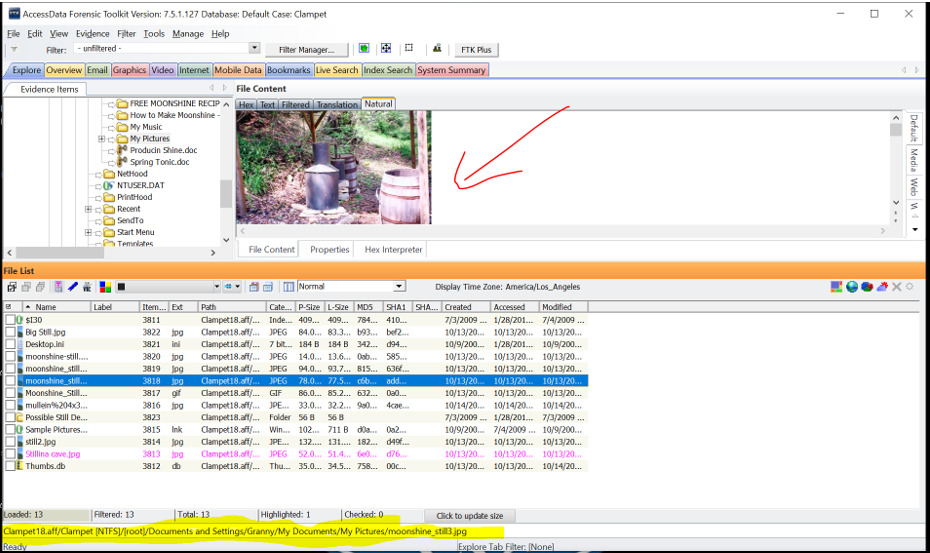
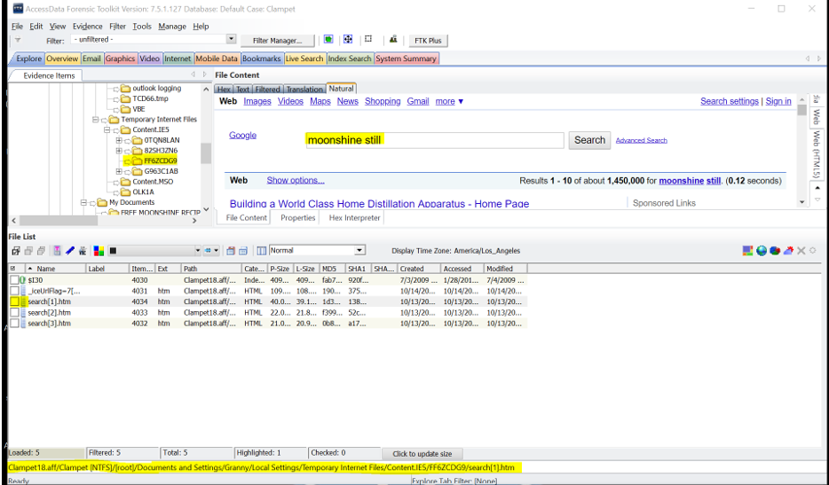
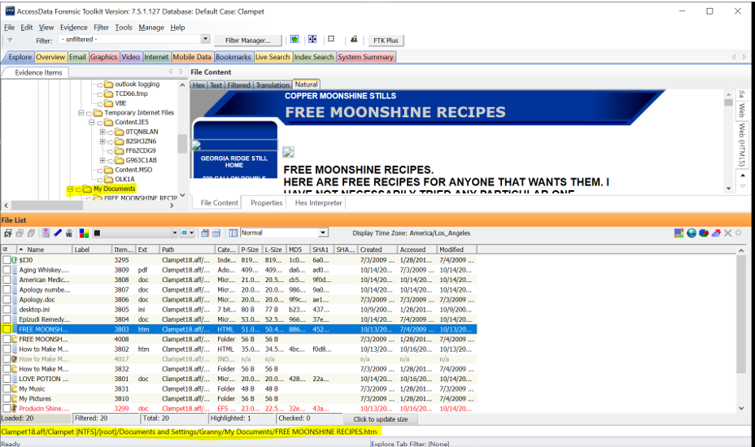
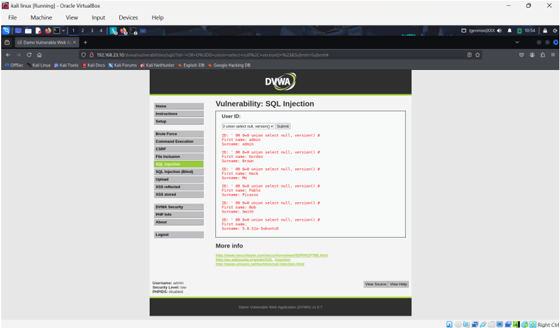
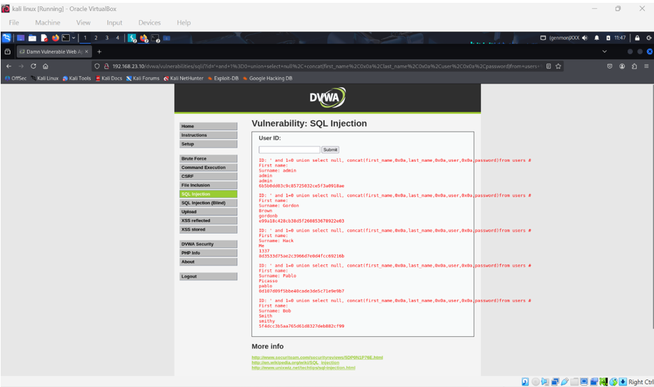
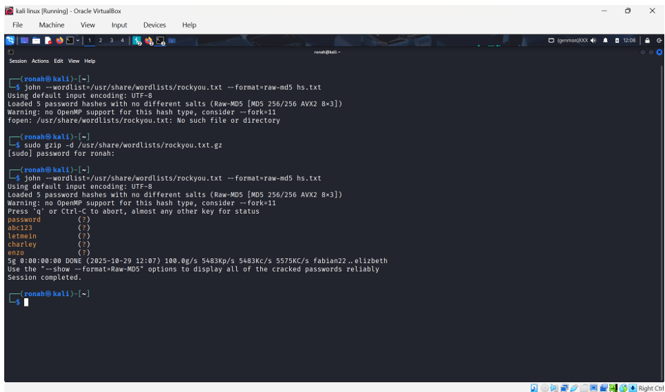
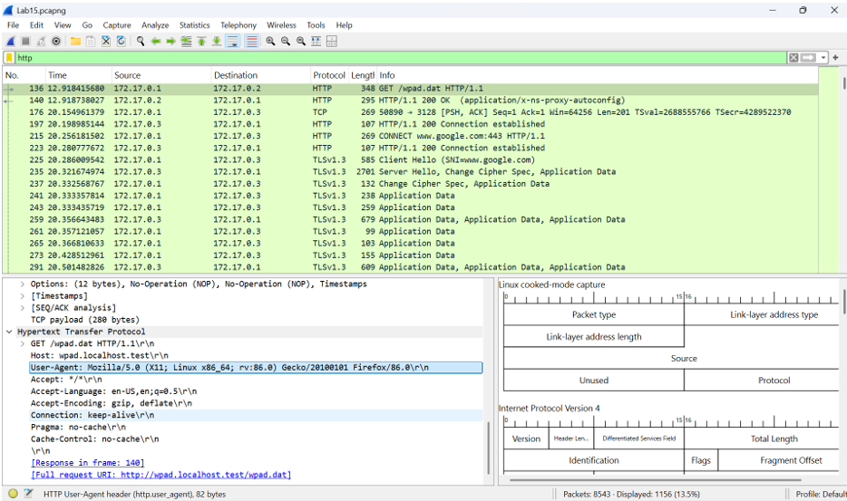
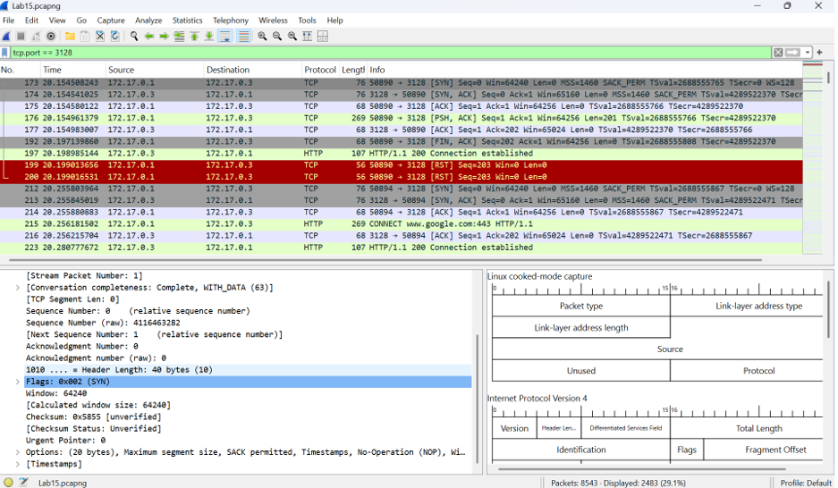

Cybersecurity Labs

Hands-on security labs completed as part of my MSc in Cybersecurity at Hood College. Work spans digital forensics, penetration testing, network security, and security operations.

---

Digital Forensics

**Clampet Forensic Investigation**  
Full investigation using AccessData FTK on the Clampet18.aff disk image. Identified primary suspect through browser cache artifacts, recovered moonshine recipes, a password-protected customer spreadsheet, and internet search history corroborating witness statements.  
Tools: AccessData FTK, FTK Imager

---

Penetration Testing

**Metasploitable2: SMB Exploitation**  
Enumerated SMB with enum4linux, identified Samba 3.0.20-Debian, exploited CVE-2007-2447 for a reverse shell. Cracked password hashes with John the Ripper.  
Tools: Metasploit, Nmap, enum4linux, John the Ripper

**DVWA: Web Application Security Assessment**
Exploited SQL injection vulnerabilities in DVWA running on Metasploitable2. Used union-based SQL injection to extract database version, usernames, and MD5 password hashes from the users table. Cracked extracted hashes using John the Ripper with the rockyou.txt wordlist, successfully recovering passwords including common weak credentials.
Tools: Kali Linux, DVWA, John the Ripper

**Network Traffic Analysis: Wireshark**
Analyzed packet captures to identify web server IP (172.17.0.2), user agent (Firefox 86.0 on Linux x86_64), proxy server IP (172.17.0.3), and proxy port (3128) using HTTP and TCP filters.
Tools: Wireshark

